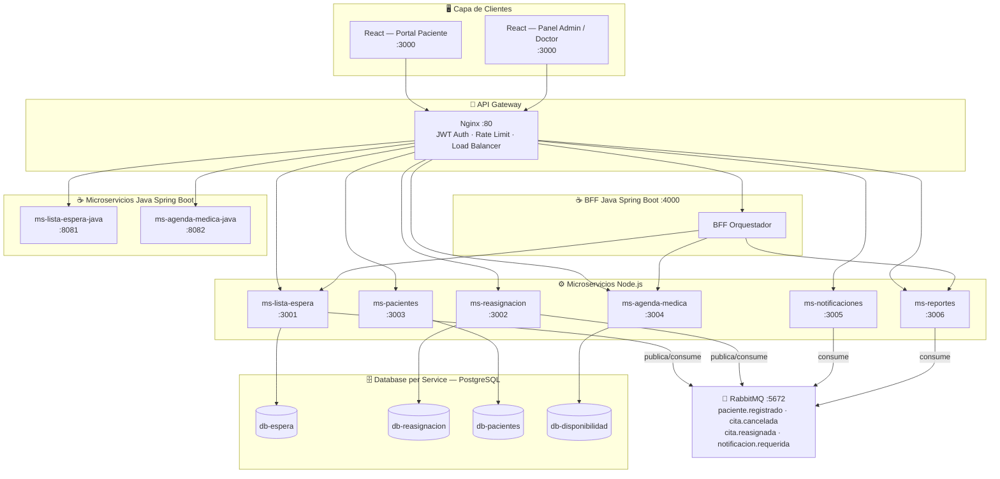

# ⚠️ Repositorio archivado — migrado a arquitectura polyrepo

> Este monorepo se conserva como **referencia histórica**. El proyecto fue reorganizado en **un repositorio por componente** (microservicios independientes, con CI/CD en GitHub Actions y despliegue en Oracle Cloud).

**➡️ La fuente de verdad ahora son estos repositorios** — empieza por **[`rednorte-infra`](https://github.com/PhamNukz/rednorte-infra)**, que contiene la orquestación y la **documentación completa** del sistema:

| Componente | Repositorio(s) |
|-----------|----------------|
| 📖 Orquestación + documentación | [`rednorte-infra`](https://github.com/PhamNukz/rednorte-infra) |
| 📚 Librería compartida | [`rednorte-shared`](https://github.com/PhamNukz/rednorte-shared) |
| ⚙️ Microservicios Node | [`rednorte-ms-lista-espera`](https://github.com/PhamNukz/rednorte-ms-lista-espera) · [`-reasignacion`](https://github.com/PhamNukz/rednorte-ms-reasignacion) · [`-pacientes`](https://github.com/PhamNukz/rednorte-ms-pacientes) · [`-agenda-medica`](https://github.com/PhamNukz/rednorte-ms-agenda-medica) · [`-notificaciones`](https://github.com/PhamNukz/rednorte-ms-notificaciones) · [`-reportes`](https://github.com/PhamNukz/rednorte-ms-reportes) |
| ☕ Servicios Java | [`rednorte-bff`](https://github.com/PhamNukz/rednorte-bff) · [`rednorte-ms-lista-espera-java`](https://github.com/PhamNukz/rednorte-ms-lista-espera-java) · [`rednorte-ms-agenda-medica-java`](https://github.com/PhamNukz/rednorte-ms-agenda-medica-java) |
| 🖥️ Frontend | [`rednorte-frontend`](https://github.com/PhamNukz/rednorte-frontend) |

---

<!-- ↓↓↓ README histórico original del monorepo ↓↓↓ -->

# Plataforma de Gestión de Listas de Espera — RedNorte

**DSY1106 Desarrollo Fullstack III | DuocUC 2026**
Docente: Bryan Soto
Integrantes: Benjamin Aravena Rosales · Francisco Gómez Ramos

---

## Arquitectura

> **Diagrama interactivo draw.io:** [📐 Abrir en draw.io](docs/architecture.drawio)



## Patrones implementados

| Patrón | Dónde |
|--------|-------|
| **Repository Pattern** | `src/repositories/` en todos los MS |
| **Factory Method** | `ms-lista-espera/src/factories/solicitudFactory.js` |
| **Circuit Breaker** | `shared/middleware/circuitBreaker.js` → usado en `ms-reasignacion` |
| **Event-Driven** | RabbitMQ en `shared/events/rabbitmq.js` |
| **CQRS** | `ms-lista-espera` (command/query separados) · `ms-reportes` (solo lectura) |
| **Database per Service** | Cada microservicio tiene su propia instancia PostgreSQL |
| **API Gateway** | Nginx con enrutamiento, JWT y rate limiting |

## Microservicios

| Servicio | Puerto | Responsabilidad |
|----------|--------|-----------------|
| ms-lista-espera | 3001 | Registro, priorización y gestión de solicitudes |
| ms-reasignacion | 3002 | Reasignación automática ante cancelaciones |
| ms-pacientes | 3003 | Perfil, historial y notificaciones de pacientes |
| ms-agenda-medica | 3004 | Disponibilidad horaria de médicos |
| ms-notificaciones | 3005 | Envío de alertas email/push/SMS |
| ms-reportes | 3006 | Dashboards e indicadores (CQRS read-only) |

## Flujo de reasignación automática

```
1. Médico/Paciente cancela cita
      ↓
2. ms-lista-espera publica evento 'cita.cancelada' en RabbitMQ
      ↓
3. ms-reasignacion consume el evento
      ↓
4. Circuit Breaker → consulta ms-lista-espera por siguiente elegible
      ↓
5. Circuit Breaker → consulta ms-agenda-medica por hora disponible
      ↓
6. Reserva la hora y publica 'cita.reasignada' + 'notificacion.requerida'
      ↓
7. ms-lista-espera actualiza estado de solicitud
8. ms-pacientes registra en historial
9. ms-notificaciones envía email/push al paciente
```

## Inicio rápido

```bash
# 1. Copiar variables de entorno
cp .env.example .env

# 2. Editar .env con tus valores (JWT_SECRET obligatorio)

# 3. Levantar todo
docker-compose up --build

# 4. Acceder
#   Portal paciente: http://localhost
#   RabbitMQ admin:  http://localhost:15672  (admin/admin123)
```

## Estructura del proyecto

```
rednorte-platform/
├── docker-compose.yml
├── .env.example
├── nginx/nginx.conf
├── docs/
│   └── architecture.drawio         ← Diagrama draw.io editable
├── shared/
│   ├── middleware/auth.js          ← JWT + RBAC
│   ├── middleware/circuitBreaker.js
│   └── events/rabbitmq.js          ← Bus de eventos
├── services/
│   ├── ms-lista-espera/
│   ├── ms-reasignacion/
│   ├── ms-pacientes/
│   ├── ms-agenda-medica/
│   ├── ms-notificaciones/
│   └── ms-reportes/
└── frontend/                       ← React.js
    └── src/
        ├── pages/Login.jsx
        ├── pages/PortalPaciente.jsx
        └── pages/PanelAdmin.jsx
```

## Roles y accesos

| Rol | Acceso |
|-----|--------|
| `paciente` | Portal paciente — ve sus solicitudes, historial y notificaciones |
| `medico` | Panel admin — gestiona lista, agenda y reportes |
| `admin` | Panel admin — acceso completo |

## Pruebas unitarias

### JavaScript — Jest

```bash
# Módulo RUT + utilidades (frontend)
cd frontend && npm test

# Factory Method (ms-lista-espera)
cd services/ms-lista-espera && npm test
```

| Archivo | Tests | Estado |
|---------|-------|--------|
| `frontend/src/utils/rut.test.js` | 23 | ✅ PASS |
| `services/ms-lista-espera/src/factories/solicitudFactory.test.js` | 22 | ✅ PASS |

Los tests cubren: algoritmo Módulo 11 de RUT chileno (validarRut, calcularDv, formatearRutInput, limpiarRut), creación de los 4 tipos de solicitud médica, validación de campos requeridos y manejo de errores.

### Java — JUnit 5 + Mockito

```bash
# Desde la raíz de cada servicio Java
cd java-services/ms-lista-espera-java && mvn test
cd java-services/ms-agenda-medica-java && mvn test
cd java-services/bff-rednorte && mvn test
```

| Archivo | Tests | Qué verifica |
|---------|-------|--------------|
| `ms-lista-espera-java/.../SolicitudFactoryTest.java` | 7 | Factory: 4 tipos clínicos, datos base, ID nulo antes de persistir |
| `ms-lista-espera-java/.../SolicitudServiceTest.java` | 7 | crear, actualizarEstado, getResumen, getSiguienteElegible |
| `ms-agenda-medica-java/.../AgendaServiceTest.java` | 8 | reservar, liberar, completar horas médicas + excepciones |
| `bff-rednorte/.../AgregadorServiceTest.java` | 7 | Facade BFF: agregación, conteo por estado, orden por prioridad |
| `bff-rednorte/.../AgregadorControllerTest.java` | — | Controlador REST del BFF |

## Seguridad

- JWT (15 min access token + 7 días refresh token)
- HTTPS/TLS en el API Gateway (Nginx)
- Rate limiting: 30 req/s por IP
- Validación de inputs en cada microservicio
- Red Docker privada entre servicios
- Headers de seguridad (Helmet.js + Nginx)
